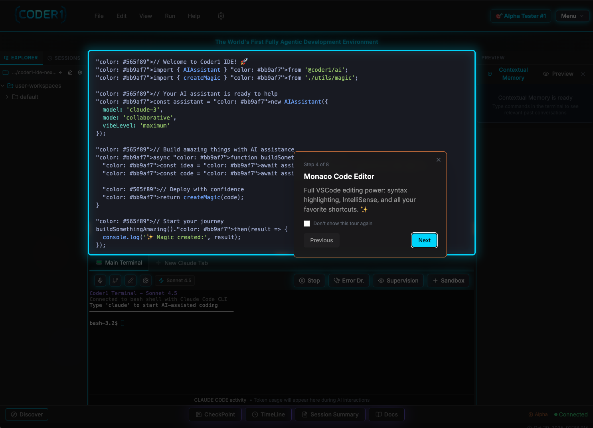
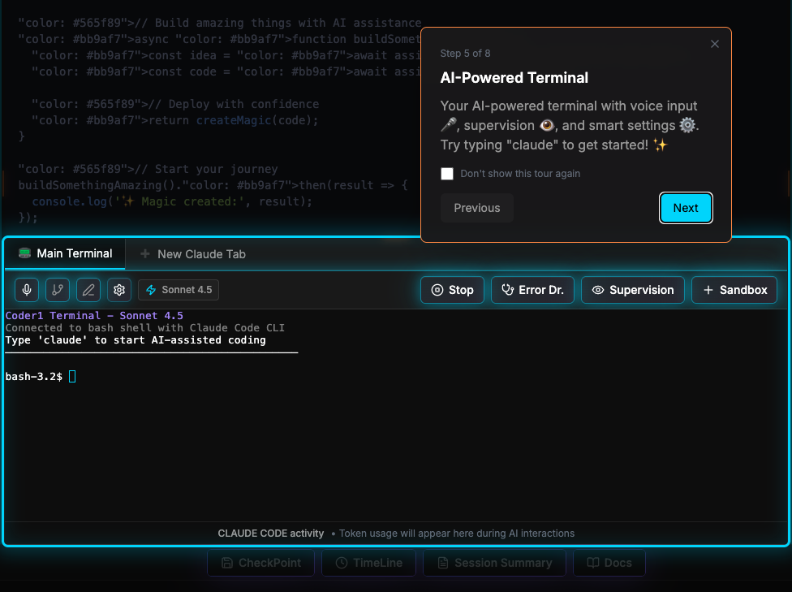
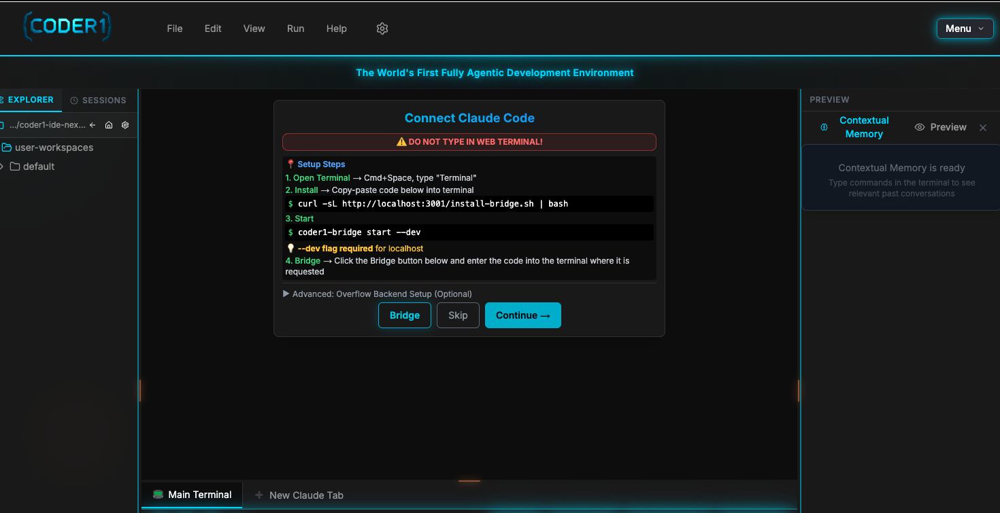
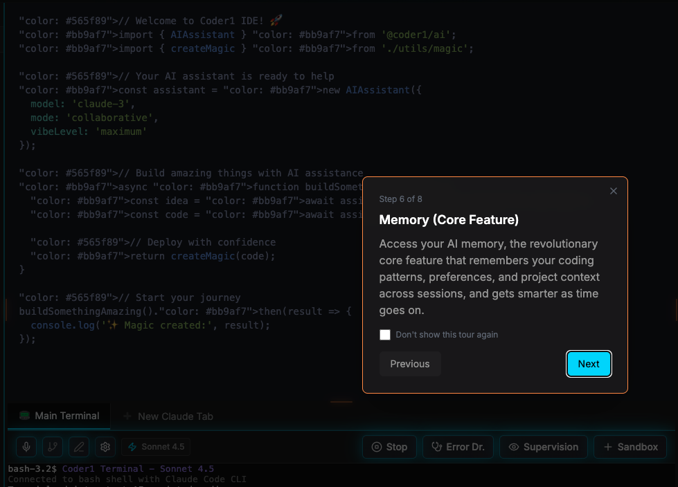

# Coder1 IDE

**The first open-source IDE built specifically for Claude Code.**

[](https://opensource.org/licenses/MIT)
[](https://github.com/MichaelrKraft/coder1-ide/stargazers)
[](https://github.com/MichaelrKraft/coder1-ide/issues)

<!-- TODO: Replace with actual demo GIF recorded this weekend -->
<!--  -->

Coder1 is a web-based IDE that bridges into your local Claude Code sessions. It gives you Monaco Editor, a live preview, an integrated terminal, and persistent memory — all in one window, all running on your machine.

No cloud dependency. No new AI subscription. It works with the Claude Code you already have installed.

---

## Why Coder1?

- **Built for Claude Code** — not a general-purpose AI IDE with Claude bolted on. Every feature is designed around Claude Code workflows.
- **Local-first** — runs on your machine. Your code, your data, your Claude subscription. Nothing is sent to our servers.
- **Persistent memory** — sessions remember context across time. Pick up where you left off, even weeks later.
- **Open core** — the core IDE is free and open source (MIT). Team collaboration features require a Pro license, but all code is visible in this repo.

## How It's Different

| Feature | Coder1 (Free) | Coder1 (Pro) | Cursor | Windsurf | V0 |
|---------|:---:|:---:|:---:|:---:|:---:|
| Built for Claude Code | Yes | Yes | No | No | No |
| Open source | Yes | Yes | No | No | No |
| Local-first | Yes | Yes | Partial | No | No |
| Persistent memory | Yes | Yes | No | No | No |
| Uses your existing subscription | Yes | Yes | No | No | No |
| Team collaboration | - | Yes | No | Yes | No |
| Shared workspaces | - | Yes | No | No | No |

---

## Quick Start

```bash
git clone https://github.com/MichaelrKraft/coder1-ide.git
cd coder1-ide/coder1-ide-next
cp .env.local.example .env.local
npm install
npm run dev
```

Open [http://localhost:3001/ide](http://localhost:3001/ide)

**Requirements**: Node.js 18+, Claude Code CLI installed

### Connect to Claude Code

1. Install the bridge CLI: `npm install -g coder1-bridge`
2. Run `coder1-bridge start` in your terminal
3. Enter the 6-digit pairing code shown in the IDE
4. Start coding — commands from the IDE execute on your machine through the bridge

---

## Screenshots

<table>
<tr>
<td><br/><em>Full Monaco Editor with syntax highlighting</em></td>
<td><br/><em>Integrated terminal with Claude Code</em></td>
</tr>
<tr>
<td><br/><em>Local bridge connects IDE to your machine</em></td>
<td><br/><em>Persistent memory across sessions</em></td>
</tr>
</table>

---

## Architecture

```
Browser (Next.js 14 + React)
    |
    | WebSocket (Socket.IO)
    |
Unified Server (Express + Next.js)
    |
    |--- Monaco Editor (code editing)
    |--- xterm.js (terminal emulation)
    |--- Live Preview (iframe sandbox)
    |
    | WebSocket
    |
Bridge CLI (runs on your machine)
    |
    | PTY
    |
Claude Code CLI
```

**Tech stack**: Next.js 14 (App Router), Monaco Editor, xterm.js, Socket.IO, Express, node-pty, TypeScript

For detailed architecture documentation, see [ARCHITECTURE.md](ARCHITECTURE.md).

---

## Project Structure

```
coder1-ide-next/
  app/              # Next.js 14 app router pages
  components/       # React components (terminal, editor, panels)
  lib/              # Utilities, socket client, hooks
  services/         # AI integration, session management, database
  stores/           # Zustand state management
  types/            # TypeScript type definitions
  server.js         # Unified Express + Socket.IO + Next.js server
  bridge-cli/       # Local bridge CLI for connecting to Claude Code
```

---

## Open Core Model

Coder1 is open core. Here's what that means:

**Free (MIT License)**:
- Full IDE with Monaco Editor
- Integrated terminal with Claude Code support
- Live preview
- Persistent memory across sessions
- AI supervision and error detection
- Session summaries and exports
- Bridge CLI for local Claude Code connection

**Pro License (Teams)**:
- Multi-user collaboration (Google Docs-style)
- Shared workspaces
- Team session management

All code — including Pro features — is visible in this repository. Team features are gated behind a license key at runtime. We believe in transparent open core.

---

## Contributing

We welcome contributions. See [CONTRIBUTING.md](CONTRIBUTING.md) for setup instructions and guidelines.

**Good places to start**:
- Issues labeled [`good first issue`](https://github.com/MichaelrKraft/coder1-ide/labels/good%20first%20issue)
- Documentation improvements
- Test coverage
- Bug reports and fixes

## Roadmap

- [ ] Plugin system for custom extensions
- [ ] Multi-file diff viewer
- [ ] Git integration panel
- [ ] Voice-to-code with Claude
- [ ] Mobile-responsive layout
- [ ] Vim/Emacs keybindings
- [ ] Self-hosted deployment guide

## Community

- [GitHub Issues](https://github.com/MichaelrKraft/coder1-ide/issues) — bug reports and feature requests
- [GitHub Discussions](https://github.com/MichaelrKraft/coder1-ide/discussions) — questions and ideas

---

## Background

I'm Mike — a solo founder who spent 8 months building Coder1 because I believed Claude Code deserved a proper IDE. No VC funding, no team, just me building the tool I wanted to use every day.

I'm open-sourcing it because I think the Claude Code community should shape what this becomes. Try it, break it, tell me what's missing.

---

## License

[MIT](LICENSE) — free for personal and commercial use.

Team collaboration features require a separate Pro license. See [coder1.ai](https://coder1.ai) for details.
