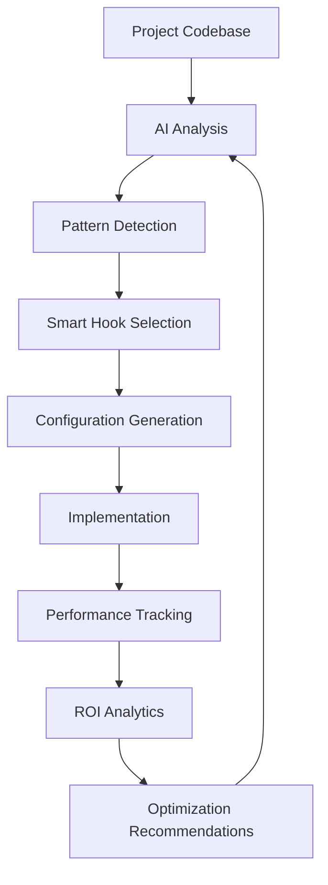

# 🤖 AI-Powered Hooks System for CoderOne

## Overview

The AI-Powered Hooks System represents a revolutionary approach to development automation. Instead of manually configuring development tools, this system uses artificial intelligence to analyze your codebase, detect optimization opportunities, and automatically generate optimized hook configurations that improve productivity, code quality, and development velocity.

## 🌟 Key Features

### 🧠 Intelligent Analysis
- **Codebase Health Scoring**: AI evaluates your project's health across multiple dimensions
- **Pattern Detection**: Identifies repetitive tasks and automation opportunities  
- **Performance Bottleneck Analysis**: Finds build time, dependency, and workflow inefficiencies
- **Security Risk Assessment**: Scans for vulnerabilities and insecure patterns
- **Workflow Optimization**: Analyzes commit patterns, testing habits, and development practices

### ⚡ Smart Configuration Generation
- **AI-Optimized Hooks**: Automatically selects and configures the most beneficial hooks
- **Project-Specific Customization**: Adapts configurations based on your technology stack
- **Performance-First Approach**: Prioritizes high-impact, low-friction optimizations
- **Implementation Planning**: Provides step-by-step setup instructions with time estimates

### 📊 Performance Tracking & ROI
- **Real-time Metrics**: Tracks hook execution performance and effectiveness
- **ROI Calculation**: Measures time savings, productivity gains, and error prevention
- **Trend Analysis**: Identifies improving and declining performance patterns
- **Optimization Recommendations**: Suggests improvements based on usage data

## 🚀 Quick Start

### 1. Access AI Suggestions in IDE

Open the CoderOne IDE and access AI hook suggestions:

```typescript
// In the IDE, click the hooks menu and select "🤖 AI Suggestions" tab
// Or access directly via the AI Hooks component
```

### 2. API Integration

For programmatic access, use the REST API:

```bash
# Analyze your project with AI
curl -X POST http://localhost:3000/api/hooks/ai-analyze

# Generate smart configuration
curl -X POST http://localhost:3000/api/hooks/smart-generate \
  -H "Content-Type: application/json" \
  -d '{"includePerformance": true, "includeSecurity": true}'

# Get AI recommendations
curl http://localhost:3000/api/hooks/ai-recommendations
```

### 3. Performance Tracking

Track hook effectiveness:

```bash
# Start tracking session
curl -X POST http://localhost:3000/api/hooks/tracking/start-session

# Track hook execution
curl -X POST http://localhost:3000/api/hooks/tracking/hook-execution \
  -H "Content-Type: application/json" \
  -d '{"hookId": "prettier-format", "executionData": {"executionTime": 1200, "success": true, "timeSaved": 30}}'

# Get analytics
curl http://localhost:3000/api/hooks/analytics?timeframe=week
```

## 🏗️ Architecture

### Core Components

```
AI Hooks System
├── 🧠 AIHookAnalyzer - Intelligent project analysis
├── ⚡ SmartHookGenerator - AI-optimized configuration generation  
├── 📊 HookPerformanceTracker - ROI tracking and analytics
├── 🎨 AIHookSuggestions (React) - UI for suggestions
└── 🔌 API Routes - RESTful endpoints for integration
```

### Data Flow



## 📖 Detailed Usage

### AI Analysis Deep Dive

The AI analyzer examines multiple aspects of your project:

#### Codebase Health Analysis
```javascript
// Example analysis result
{
  "codebaseHealth": {
    "score": 85,
    "issues": [
      {
        "type": "large_files",
        "severity": "medium", 
        "message": "5 files are unusually large (>500 lines)",
        "suggestion": "Consider splitting large files into smaller modules"
      }
    ],
    "metrics": {
      "averageFileSize": 180,
      "duplicationScore": 0.15,
      "unusedImports": 23
    }
  }
}
```

#### Workflow Pattern Analysis
```javascript
{
  "workflowPatterns": {
    "commitFrequency": { "frequency": 0.8 }, // commits per day
    "testingHabits": { "coverage": 0.7 },
    "buildFrequency": { "frequency": 5 },
    "suggestions": [
      {
        "hookId": "auto-test-runner",
        "action": "Automatically run relevant tests when files change",
        "priority": "high",
        "reason": "Low test coverage detected"
      }
    ]
  }
}
```

### Smart Configuration Options

#### Configuration Modes
```javascript
// Conservative mode - minimal disruption
const conservativeConfig = await smartGenerator.generateSmartConfiguration({
  includePerformance: true,
  includeSecurity: true,
  includeQuality: false,
  includeWorkflow: false,
  aggressiveOptimization: false
});

// Aggressive mode - maximum optimization
const aggressiveConfig = await smartGenerator.generateSmartConfiguration({
  includePerformance: true,
  includeSecurity: true,
  includeQuality: true,
  includeWorkflow: true,
  aggressiveOptimization: true
});
```

#### Generated Configuration Example
```json
{
  "hooks": {
    "on-edit": [
      {
        "id": "prettier-format",
        "config": {
          "printWidth": 80,
          "tabWidth": 2,
          "semi": true
        }
      }
    ],
    "pre-commit": [
      {
        "id": "eslint-fix",
        "severity": "strict"
      }
    ]
  },
  "ai": {
    "enabled": true,
    "analysisInterval": "daily",
    "adaptiveOptimization": true,
    "notifications": {
      "healthScore": true,
      "performance": true,
      "security": true
    }
  }
}
```

### Performance Tracking Integration

#### Session Management
```javascript
// Start tracking session
const sessionId = await performanceTracker.startSession('dev-session-001');

// Track hook execution
await performanceTracker.trackHookExecution('prettier-format', {
  executionTime: 1200,    // milliseconds
  success: true,
  timeSaved: 30,          // seconds saved by automation
  context: { 
    fileType: 'javascript',
    fileSize: 1500 
  }
});

// Track AI recommendation implementation
await performanceTracker.trackAIRecommendation('ai-security', {
  hookIds: ['security-scanner', 'secret-detector'],
  timeTaken: 300,         // seconds to implement
  success: true,
  userFeedback: 'Very helpful recommendations',
  measuredImpact: { 
    securityImprovement: 0.3,
    timeEfficiency: 0.2 
  }
});

// End session and calculate ROI
const sessionResult = await performanceTracker.endSession({
  userRating: 4,
  feedback: 'Significant productivity improvement',
  overallSatisfaction: 'high'
});
```

#### Analytics Dashboard Data
```javascript
{
  "analytics": {
    "summary": {
      "totalHooks": 12,
      "activeHooks": 8,
      "totalTimeSaved": 450,  // minutes this week
      "totalExecutions": 234,
      "averageSuccessRate": 94,
      "mostValuableHook": "auto-test-runner"
    },
    "topPerformers": [
      {
        "id": "prettier-format",
        "impactScore": 8.5,
        "timeSaved": 120,
        "successRate": 98,
        "executions": 145
      }
    ],
    "roi": {
      "weeklyTimeSavings": 450,
      "monthlyTimeSavings": 1800,
      "estimatedCostSavings": 375,  // dollars
      "productivityGain": 0.25      // 25% improvement
    }
  }
}
```

## 🎨 UI Components

### React Components Integration

```typescript
// Main AI Suggestions Component
import AIHookSuggestions from './components/hooks/AIHookSuggestions';

function MyIDE() {
  return (
    <div>
      {/* Other IDE components */}
      <AIHookSuggestions />
    </div>
  );
}

// Enhanced Hooks Menu with AI Tab
import QuickHooksMenu from './components/hooks/QuickHooksMenu';

function IDE() {
  const [showHooksMenu, setShowHooksMenu] = useState(false);
  
  return (
    <div>
      <button onClick={() => setShowHooksMenu(true)}>
        🪝 Hooks
      </button>
      
      <QuickHooksMenu 
        isOpen={showHooksMenu}
        onClose={() => setShowHooksMenu(false)}
      />
    </div>
  );
}
```

### Component Features

#### AI Suggestions Display
- **Health Score Visualization**: Shows project health with color-coded scoring
- **Recommendation Cards**: Interactive cards showing hook suggestions with priority
- **Implementation Preview**: Shows time estimates and step-by-step plans
- **Confidence Indicators**: AI confidence levels for each recommendation
- **One-Click Generation**: Generate and apply configurations instantly

#### Performance Dashboard
- **Real-time Metrics**: Live hook execution statistics
- **ROI Visualization**: Charts showing time savings and productivity gains
- **Trend Analysis**: Visual trends for hook performance over time
- **Problem Identification**: Highlights hooks with issues requiring attention

## 🔧 Advanced Configuration

### Custom AI Analysis

```javascript
// Extend the AIHookAnalyzer for custom analysis
class CustomAIAnalyzer extends AIHookAnalyzer {
  async analyzeProject() {
    const baseAnalysis = await super.analyzeProject();
    
    // Add custom analysis logic
    const customMetrics = await this.analyzeCustomPatterns();
    
    return {
      ...baseAnalysis,
      customMetrics,
      aiRecommendations: [
        ...baseAnalysis.aiRecommendations,
        ...this.generateCustomRecommendations(customMetrics)
      ]
    };
  }
  
  async analyzeCustomPatterns() {
    // Custom pattern detection logic
    return {
      apiUsagePatterns: await this.analyzeAPIUsage(),
      errorPatterns: await this.analyzeErrorPatterns(),
      performanceAntiPatterns: await this.analyzePerformanceIssues()
    };
  }
}
```

### Hook Template Extensions

```javascript
// Add custom hook templates
const customTemplates = {
  'custom-api-validator': {
    id: 'custom-api-validator',
    name: 'API Response Validator',
    description: 'Validates API responses against schema',
    category: 'quality',
    config: {
      trigger: 'on-api-call',
      action: 'validate-response',
      schema: 'api-schema.json'
    }
  }
};

// Register with templates
templates.addCustomTemplates(customTemplates);
```

### Performance Metrics Customization

```javascript
// Custom metric calculation
class CustomPerformanceTracker extends HookPerformanceTracker {
  calculateImpactScore(hookMetrics) {
    const baseScore = super.calculateImpactScore(hookMetrics);
    
    // Add custom scoring factors
    const customFactors = {
      teamCollaboration: hookMetrics.context.teamUsage || 0,
      codeQualityImprovement: hookMetrics.context.qualityGain || 0,
      learningCurve: hookMetrics.context.easeOfUse || 1
    };
    
    return baseScore * (1 + customFactors.teamCollaboration * 0.2);
  }
}
```

## 📊 API Reference

### Core Endpoints

#### Analysis Endpoints
```http
POST /api/hooks/ai-analyze
# Run comprehensive AI analysis of the project

GET /api/hooks/ai-recommendations?category=security&priority=high
# Get filtered AI recommendations

POST /api/hooks/ai-preview
# Preview AI-generated configuration without saving
```

#### Configuration Endpoints
```http
POST /api/hooks/smart-generate
Content-Type: application/json
{
  "includePerformance": true,
  "includeSecurity": true,
  "includeQuality": true,
  "includeWorkflow": true,
  "aggressiveOptimization": false
}
# Generate AI-optimized hook configuration

POST /api/hooks/smart-update
Content-Type: application/json
{
  "config": { /* existing config */ },
  "options": { "scope": "project" }
}
# Update existing configuration with AI recommendations
```

#### Performance Tracking Endpoints
```http
POST /api/hooks/tracking/start-session
Content-Type: application/json
{ "sessionId": "dev-session-001" }
# Start performance tracking session

POST /api/hooks/tracking/hook-execution
Content-Type: application/json
{
  "hookId": "prettier-format",
  "executionData": {
    "executionTime": 1200,
    "success": true,
    "timeSaved": 30,
    "context": { "fileType": "javascript" }
  }
}
# Track hook execution performance

POST /api/hooks/tracking/end-session
Content-Type: application/json
{
  "feedback": {
    "userRating": 4,
    "feedback": "Great improvements to workflow"
  }
}
# End session and calculate ROI

GET /api/hooks/analytics?timeframe=week
# Get comprehensive performance analytics
```

### Response Formats

#### AI Analysis Response
```json
{
  "success": true,
  "analysis": {
    "timestamp": "2025-01-20T15:30:00Z",
    "projectType": "react",
    "codebaseHealth": {
      "score": 85,
      "issues": [...],
      "suggestions": [...]
    },
    "aiRecommendations": [
      {
        "id": "ai-security",
        "name": "Security & Compliance",
        "description": "AI-powered security scanning and vulnerability prevention",
        "priority": "high",
        "hooks": ["security-scanner", "secret-detector"],
        "confidence": 0.9,
        "estimatedImpact": "high"
      }
    ]
  }
}
```

#### Smart Generation Response
```json
{
  "success": true,
  "config": { /* Generated configuration */ },
  "selectedHooks": ["prettier-format", "eslint-fix", "test-runner"],
  "optimizations": [
    {
      "type": "quality",
      "impact": "medium",
      "reason": "Code health score is 75/100",
      "hooks": ["eslint-fix", "code-complexity-monitor"]
    }
  ],
  "implementation": {
    "phases": [
      {
        "name": "Critical Setup",
        "order": 1,
        "hooks": ["security-scanner"],
        "estimatedTime": "5-10 minutes"
      }
    ],
    "estimatedTime": 15
  },
  "estimatedBenefits": {
    "timeSavings": 45,
    "qualityImprovement": 20,
    "errorReduction": 15,
    "performanceGain": 10
  }
}
```

#### Performance Analytics Response
```json
{
  "success": true,
  "analytics": {
    "summary": {
      "totalHooks": 12,
      "activeHooks": 8,
      "totalTimeSaved": 450,
      "averageSuccessRate": 94
    },
    "hookPerformance": [
      {
        "id": "prettier-format",
        "executions": 145,
        "successRate": 98,
        "avgExecutionTime": 800,
        "timeSaved": 120,
        "impactScore": 8.5,
        "trend": "stable"
      }
    ],
    "roi": {
      "weeklyTimeSavings": 450,
      "monthlyTimeSavings": 1800,
      "estimatedCostSavings": 375,
      "productivityGain": 0.25
    },
    "topPerformers": [...],
    "problemAreas": [
      {
        "type": "slow_execution",
        "hookId": "heavy-linter",
        "severity": "medium",
        "avgTime": 5500,
        "recommendation": "Optimize hook implementation for better performance"
      }
    ]
  }
}
```

## 🔍 Troubleshooting

### Common Issues

#### AI Analysis Not Working
```bash
# Check if AI services are properly initialized
curl -X POST http://localhost:3000/api/hooks/ai-analyze

# If getting errors, check logs for:
# - Missing dependencies
# - File permission issues
# - Network connectivity
```

#### Performance Tracking Data Missing
```javascript
// Initialize tracking data manually
const tracker = new HookPerformanceTracker();
await tracker.initializeTracking();

// Check if data directories exist
ls -la src/data/
```

#### UI Components Not Loading
```typescript
// Verify imports and dependencies
import AIHookSuggestions from './components/hooks/AIHookSuggestions';

// Check for missing React dependencies
npm list react react-dom lucide-react
```

### Debugging Tips

#### Enable Debug Logging
```javascript
// Set debug mode in AI analyzer
const analyzer = new AIHookAnalyzer();
analyzer.debugMode = true;

// Enable performance tracking logs
const tracker = new HookPerformanceTracker();
tracker.logLevel = 'debug';
```

#### Validate Configuration
```bash
# Test the system end-to-end
node test-ai-hooks.js

# Check specific components
node -e "
const { AIHookAnalyzer } = require('./src/services/hooks/AIHookAnalyzer');
const analyzer = new AIHookAnalyzer();
analyzer.analyzeProject().then(console.log);
"
```

## 🚀 Future Enhancements

### Planned Features

#### Advanced AI Capabilities
- **Machine Learning Models**: Custom ML models trained on your codebase
- **Predictive Analytics**: Predict which hooks will be most beneficial
- **Adaptive Configuration**: Automatically adjust hook parameters based on usage
- **Team Collaboration**: AI recommendations based on team patterns

#### Enhanced Integrations
- **CI/CD Integration**: Automatic hook deployment in CI pipelines
- **IDE Extensions**: Native VS Code and IntelliJ plugins
- **Slack/Teams Notifications**: Real-time productivity reports
- **GitHub Integration**: PR comments with hook suggestions

#### Advanced Analytics
- **A/B Testing**: Compare different hook configurations
- **Team Dashboards**: Organization-wide productivity metrics
- **Custom Reports**: Tailored analytics for managers and leads
- **Benchmark Comparisons**: Compare against industry standards

### Contributing

To contribute to the AI Hooks System:

1. **Fork the Repository**: Create your own fork of the project
2. **Create Feature Branch**: `git checkout -b feature/ai-enhancement`
3. **Add Tests**: Include tests for new functionality
4. **Update Documentation**: Keep this guide up-to-date
5. **Submit PR**: Create a pull request with detailed description

#### Development Setup
```bash
# Clone the repository
git clone https://github.com/your-org/coder1-ai-hooks

# Install dependencies
npm install

# Run tests
npm test

# Start development server
npm run dev
```

## 📞 Support

For questions, issues, or feature requests:

- **GitHub Issues**: [Create an issue](https://github.com/your-org/coder1-ai-hooks/issues)
- **Discord**: Join our community server
- **Email**: ai-hooks-support@coder1.dev
- **Documentation**: [Full API Docs](https://docs.coder1.dev/ai-hooks)

---

## 🎉 Conclusion

The AI-Powered Hooks System represents the future of development automation. By leveraging artificial intelligence to understand your codebase and optimize your workflow, it provides unprecedented productivity gains while maintaining code quality and security.

**Key Benefits:**
- ⏱️ **Save 2-4 hours per week** through intelligent automation
- 📈 **Improve code quality** with AI-selected quality tools
- 🔒 **Enhance security** with proactive vulnerability detection
- 🎯 **Optimize performance** with targeted build and runtime improvements
- 📊 **Track ROI** with comprehensive analytics and reporting

Get started today and experience the power of AI-assisted development!

---

*Last Updated: January 2025*  
*Version: 1.0.0*  
*Built with ❤️ for the CoderOne community*