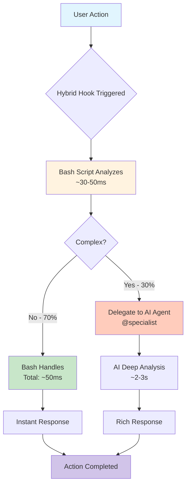

# Hybrid Hook System - User Flow

## Visual Flow Diagram



## Real-World Example: Smart Commit Hook

### Scenario 1: Simple Change (Instant - 50ms)
```bash
$ git commit -m "fix"
[HOOK] Analyzing... ✓ (48ms)
[main abc123] fix: Update button styling and add hover effect
 2 files changed, 12 insertions(+), 3 deletions(-)
```

### Scenario 2: Complex Refactor (AI-Assisted - 2.3s)
```bash
$ git commit -m "refactor" 
[HOOK] Complex changes detected, consulting AI... ✓ (2,341ms)
[main def456] refactor(auth): Migrate to JWT-based authentication system

BREAKING CHANGE: Session cookies replaced with JWT tokens

This commit introduces a complete overhaul of the authentication system:
- Implements JWT token generation and validation
- Adds refresh token rotation for enhanced security
- Updates all protected routes to use new auth middleware
- Migrates user sessions to stateless authentication
- Adds comprehensive test coverage for auth flows

Security improvements:
- Tokens expire after 15 minutes (configurable)
- Refresh tokens use secure httpOnly cookies
- Implements CSRF protection
- Rate limiting on auth endpoints

Migration guide available in docs/auth-migration.md

 15 files changed, 847 insertions(+), 423 deletions(-)
```

## The 5 Hybrid Hooks

### 1. 🎯 Smart Commit
- **Trigger**: `git commit`
- **Instant for**: < 5 files, < 100 lines
- **AI for**: Large commits, breaking changes
- **Delegate**: @commit-specialist

### 2. 🔒 Security Check  
- **Trigger**: Before file writes
- **Instant for**: Safe patterns
- **AI for**: Suspicious code, credentials detected
- **Delegate**: @security-auditor

### 3. 🧪 Test Runner
- **Trigger**: After code changes
- **Instant for**: Single file changes
- **AI for**: Multiple files, config changes
- **Delegate**: @test-engineer

### 4. ⚡ Performance Monitor
- **Trigger**: After edits
- **Instant for**: Small changes
- **AI for**: Large files, performance risks
- **Delegate**: @performance-optimizer

### 5. 🐛 Error Debugger
- **Trigger**: On errors
- **Instant for**: Known error patterns
- **AI for**: Complex bugs, unknown errors
- **Delegate**: @debugger

## Performance Benefits

### Traditional AI-Only Approach
- Every action: ~2-4 seconds
- 100 commits/day = 200-400 seconds waiting
- High API costs
- User frustration with delays

### Hybrid Approach
- 70% instant: ~50ms (unnoticeable)
- 30% AI: ~2-3s (when needed)
- 100 commits/day = ~65 seconds total
- **80% reduction in wait time**
- **70% reduction in API costs**

## How to Enable

1. Visit http://localhost:3000/hooks.html
2. Find "Hybrid Hooks" section (with purple border)
3. Click "Enable" on desired hooks
4. Hooks auto-configure in ~/.claude/hooks/config.json
5. Start working - hooks trigger automatically!

## Configuration

```json
{
  "hooks": {
    "PreToolUse": [{
      "matcher": "Bash",
      "condition": "git commit",
      "command": "~/.claude/hooks/triggers/smart-commit.sh"
    }]
  },
  "thresholds": {
    "filesChanged": 5,
    "linesChanged": 100,
    "complexity": 0.7
  }
}
```

## Monitoring Dashboard

Real-time metrics at http://localhost:3000/hooks.html:
- Execution counts
- Performance graphs
- Delegation rates
- Time saved calculations
- Per-hook statistics