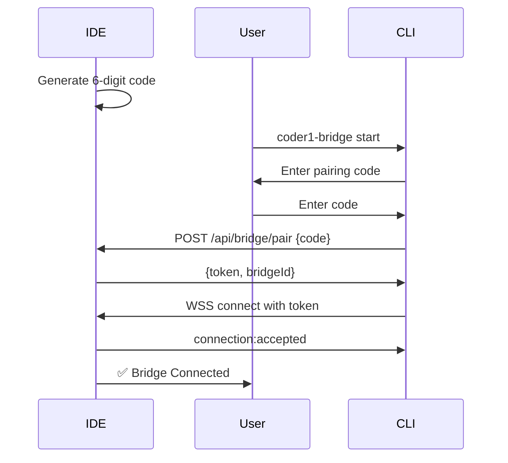

# Coder1 Bridge Protocol Specification v1.0

## Overview
The Coder1 Bridge Protocol enables secure, bidirectional communication between the web-deployed IDE and local Claude CLI installations. This document defines all message types, flows, and security requirements.

## Protocol Architecture

```
Web IDE (Render) ←── WSS (Socket.IO) ──→ Bridge CLI (Local)
```

## Connection Flow

### 1. Pairing Process


## Message Types

### Client → Server Messages

#### 1. Authentication
```typescript
{
  type: 'auth:pair',
  payload: {
    code: string,        // 6-digit pairing code
    version: string,     // Bridge CLI version
    platform: string,    // darwin|linux|win32
    claudeVersion?: string // Claude CLI version if detected
  }
}
```

#### 2. Claude Command Output
```typescript
{
  type: 'claude:output',
  payload: {
    sessionId: string,   // Terminal session ID
    commandId: string,   // Unique command ID
    data: string,        // Output chunk
    stream: 'stdout' | 'stderr',
    timestamp: number
  }
}
```

#### 3. Claude Command Complete
```typescript
{
  type: 'claude:complete',
  payload: {
    sessionId: string,
    commandId: string,
    exitCode: number,
    duration: number,    // ms
    error?: string
  }
}
```

#### 4. File Operations Response
```typescript
{
  type: 'file:response',
  payload: {
    requestId: string,
    operation: 'read' | 'write' | 'list' | 'exists',
    result?: any,        // Operation-specific result
    error?: string
  }
}
```

#### 5. Heartbeat
```typescript
{
  type: 'heartbeat',
  payload: {
    timestamp: number,
    status: 'active' | 'idle',
    stats: {
      commandsExecuted: number,
      uptime: number,    // seconds
      memoryUsage: number // MB
    }
  }
}
```

### Server → Client Messages

#### 1. Execute Claude Command
```typescript
{
  type: 'claude:execute',
  payload: {
    sessionId: string,
    commandId: string,
    command: string,     // Full command with args
    context: {
      workingDirectory: string,
      currentFile?: string,
      selection?: string,
      envVars?: Record<string, string>
    }
  }
}
```

#### 2. File Operation Request
```typescript
{
  type: 'file:request',
  payload: {
    requestId: string,
    operation: 'read' | 'write' | 'list' | 'exists',
    path: string,
    content?: string,    // For write operations
    options?: {
      encoding?: string,
      recursive?: boolean
    }
  }
}
```

#### 3. Connection Control
```typescript
{
  type: 'connection:accepted' | 'connection:rejected' | 'connection:terminate',
  payload: {
    reason?: string,
    bridgeId?: string,   // Unique bridge identifier
    capabilities?: string[] // ['claude', 'files', 'git', etc.]
  }
}
```

#### 4. Configuration Update
```typescript
{
  type: 'config:update',
  payload: {
    maxCommandTimeout?: number,  // ms
    allowedCommands?: string[],
    blockedCommands?: string[],
    workingDirectory?: string
  }
}
```

## Security Requirements

### 1. Authentication
- **Pairing codes**: 6 digits, expire after 5 minutes
- **JWT tokens**: RS256 signed, 24-hour expiry
- **Token refresh**: Automatic before expiry

### 2. Command Sanitization
```javascript
// Blocked patterns (prevent injection)
const BLOCKED_PATTERNS = [
  /rm\s+-rf\s+\//,        // Prevent root deletion
  /:(){ :|:& };:/,        // Fork bomb
  /\$\(.*\)/,             // Command substitution
  /`.*`/,                 // Backtick substitution
  /&&|\|\|/,              // Command chaining (optional)
];
```

### 3. Path Restrictions
```javascript
// Enforce working directory boundaries
const isPathAllowed = (requestedPath) => {
  const resolved = path.resolve(workingDir, requestedPath);
  return resolved.startsWith(workingDir);
};
```

### 4. Rate Limiting
- **Command execution**: Max 10/minute per session
- **File operations**: Max 100/minute
- **Authentication attempts**: Max 3/minute

## Error Handling

### Error Codes
```typescript
enum BridgeErrorCode {
  // Authentication errors (1xxx)
  INVALID_PAIRING_CODE = 1001,
  TOKEN_EXPIRED = 1002,
  UNAUTHORIZED = 1003,
  
  // Command errors (2xxx)
  COMMAND_TIMEOUT = 2001,
  COMMAND_FAILED = 2002,
  CLAUDE_NOT_FOUND = 2003,
  COMMAND_BLOCKED = 2004,
  
  // File errors (3xxx)
  FILE_NOT_FOUND = 3001,
  PERMISSION_DENIED = 3002,
  PATH_TRAVERSAL_ATTEMPT = 3003,
  
  // Connection errors (4xxx)
  CONNECTION_LOST = 4001,
  HEARTBEAT_TIMEOUT = 4002,
  VERSION_MISMATCH = 4003,
  
  // System errors (5xxx)
  INTERNAL_ERROR = 5001,
  RATE_LIMIT_EXCEEDED = 5002
}
```

### Error Message Format
```typescript
{
  type: 'error',
  payload: {
    code: BridgeErrorCode,
    message: string,
    details?: any,
    recoverable: boolean
  }
}
```

## Connection Management

### Heartbeat Protocol
- **Interval**: Every 30 seconds
- **Timeout**: Miss 3 heartbeats = disconnect
- **Auto-reconnect**: Exponential backoff (1s, 2s, 4s, 8s, max 30s)

### Session Recovery
```typescript
// Client stores session state
const sessionState = {
  bridgeId: string,
  token: string,
  lastCommandId: string,
  workingDirectory: string
};

// On reconnect, restore state
socket.on('connect', () => {
  socket.emit('session:restore', sessionState);
});
```

## Performance Specifications

### Latency Requirements
- **Command routing**: < 50ms
- **Output streaming**: < 100ms per chunk
- **File operations**: < 500ms for files < 1MB

### Throughput
- **Concurrent commands**: Up to 5 per bridge
- **Output buffer**: 1MB per command
- **File size limit**: 10MB per operation

## Version Compatibility

### Protocol Version Header
```typescript
// All messages include version
{
  version: '1.0.0',
  type: string,
  payload: any
}
```

### Compatibility Matrix
| IDE Version | Bridge Version | Status |
|------------|---------------|---------|
| 1.0.x      | 1.0.x        | ✅ Full |
| 1.0.x      | 1.1.x        | ✅ Full |
| 1.1.x      | 1.0.x        | ⚠️ Limited |

## Implementation Notes

### Socket.IO Configuration
```javascript
// Server
const bridgeNamespace = io.of('/bridge', {
  cors: {
    origin: process.env.ALLOWED_ORIGINS?.split(',') || '*',
    credentials: true
  },
  pingTimeout: 60000,
  pingInterval: 30000
});

// Client
const socket = io(`${SERVER_URL}/bridge`, {
  auth: { token },
  transports: ['websocket'],
  reconnection: true,
  reconnectionDelay: 1000,
  reconnectionDelayMax: 30000,
  reconnectionAttempts: Infinity
});
```

### Command Execution Pipeline
```
1. Receive command from IDE
2. Validate against security rules
3. Queue if at capacity
4. Execute with timeout
5. Stream output chunks
6. Send completion status
```

## Testing Requirements

### Unit Tests
- Message serialization/deserialization
- Security rule validation
- Error code handling

### Integration Tests
- Full pairing flow
- Command execution with timeout
- File operations with permissions
- Reconnection scenarios

### End-to-End Tests
- Multi-session support
- Concurrent command execution
- Large output streaming
- Network interruption recovery

## Future Extensions (v2.0)

### Planned Features
1. **Bi-directional file sync**: Watch local changes
2. **Project templates**: Quick-start projects
3. **Team collaboration**: Shared bridge sessions
4. **Cloud backup**: Command history and outputs
5. **Plugin system**: Custom command handlers

### Reserved Message Types
- `project:*` - Project management
- `sync:*` - File synchronization
- `team:*` - Collaboration features
- `plugin:*` - Plugin system

## Appendix: Quick Reference

### Most Common Messages
```javascript
// CLI → Server: Command output
{ type: 'claude:output', payload: { sessionId, commandId, data } }

// Server → CLI: Execute command
{ type: 'claude:execute', payload: { sessionId, commandId, command } }

// Both: Heartbeat
{ type: 'heartbeat', payload: { timestamp, status } }
```

### Connection States
```
DISCONNECTED → CONNECTING → AUTHENTICATING → CONNECTED → ACTIVE
                    ↑              ↓              ↓
                    └──────────────┴── ERROR ────┘
```

---
*Last Updated: January 20, 2025*
*Version: 1.0.0*
*Status: Implementation Ready*