import { Callout } from '@/components/Callout';
import { Steps, Step } from '@/components/Steps';

# Architecture Overview

<div className="my-8 text-center">
  <h2 className="text-4xl font-bold mb-4 bg-gradient-to-r from-blue-400 to-purple-400 bg-clip-text text-transparent">
    Built for Performance, Scale, and Simplicity
  </h2>
  <p className="text-xl text-slate-300 max-w-3xl mx-auto">
    Coder1's unified server architecture eliminates complexity while delivering enterprise-grade features.
  </p>
</div>

## The Unified Server Approach

Unlike traditional IDEs that require multiple services, Coder1 runs everything on a **single Next.js server** at port 3001.

<div className="grid md:grid-cols-2 gap-6 my-8">
  <div className="bg-red-900/10 border border-red-500/30 rounded-lg p-6">
    <h3 className="text-xl font-semibold text-red-400 mb-4">❌ Traditional Approach</h3>
    <div className="space-y-2 text-sm text-slate-300 font-mono">
      <div>Frontend: :3000</div>
      <div>Backend API: :5000</div>
      <div>WebSocket: :8080</div>
      <div>Terminal: :7000</div>
      <div>Preview: :4000</div>
    </div>
    <div className="mt-4 text-slate-400 text-sm">
      5 separate processes | Complex orchestration | CORS issues | Deployment complexity
    </div>
  </div>
  
  <div className="bg-green-900/10 border border-green-500/30 rounded-lg p-6">
    <h3 className="text-xl font-semibold text-green-400 mb-4">✅ Coder1 Approach</h3>
    <div className="space-y-2 text-sm text-slate-300 font-mono">
      <div className="text-blue-400">All Services: :3001</div>
      <div className="ml-4">├── Next.js Pages</div>
      <div className="ml-4">├── API Routes</div>
      <div className="ml-4">├── WebSocket Server</div>
      <div className="ml-4">├── Terminal PTY</div>
      <div className="ml-4">└── Preview System</div>
    </div>
    <div className="mt-4 text-green-400 text-sm">
      1 unified process | Simple deployment | No CORS | Single config
    </div>
  </div>
</div>

## System Architecture

```mermaid
graph TB
    Browser[Browser Client]
    NextJS[Next.js Custom Server :3001]
    Monaco[Monaco Editor]
    Terminal[XTerm Terminal]
    FS[File System]
    Git[Git Worktrees]
    Claude[Claude CLI Processes]
    
    Browser -->|HTTP/WebSocket| NextJS
    Browser --> Monaco
    Browser --> Terminal
    
    NextJS -->|API Routes| FS
    NextJS -->|WebSocket| Terminal
    NextJS -->|Spawn| Claude
    
    Claude -->|Work in| Git
    Terminal -->|PTY| NextJS
    
    style NextJS fill:#1e40af
    style Browser fill:#064e3b
    style Claude fill:#7c3aed
```



<Callout type="info" title="Custom Server">
Coder1 uses Next.js with a **custom server** (`server/index.ts`) that combines Express middleware with Next.js request handling for maximum flexibility.
</Callout>

## Core Components

### 1. Next.js Frontend (App Router)

<div className="bg-slate-800/50 border border-slate-700 rounded-lg p-4 my-4">
```
/app/
├── ide/
│   └── page.tsx          # Main IDE interface
├── consultation/
│   └── page.tsx          # Multi-persona consultation
├── documentation/
│   └── page.tsx          # Built-in docs
├── hooks/
│   └── page.tsx          # AI Hooks management
├── timeline/
│   └── page.tsx          # Project timeline view
└── layout.tsx            # Root layout
```
</div>

**Key Features**:
- Server-side rendering for instant load times
- Client-side hydration for interactivity
- Automatic code splitting per route
- Optimized asset loading

### 2. API Routes Layer

All backend logic is exposed via Next.js API routes:

<div className="grid md:grid-cols-2 gap-4 my-6">
  {[
    { endpoint: '/api/claude/route.ts', desc: 'Claude AI communication' },
    { endpoint: '/api/sessions/route.ts', desc: 'Session management' },
    { endpoint: '/api/checkpoint/route.ts', desc: 'Code checkpoints' },
    { endpoint: '/api/preview/route.ts', desc: 'Live preview generation' },
    { endpoint: '/api/terminal-rest/sessions', desc: 'Terminal session REST API' },
    { endpoint: '/api/timeline/route.ts', desc: 'Project timeline data' }
  ].map((api) => (
    <div key={api.endpoint} className="bg-slate-800/30 border border-slate-700 rounded-lg p-4">
      <div className="font-mono text-sm text-blue-400 mb-2">{api.endpoint}</div>
      <div className="text-xs text-slate-400">{api.desc}</div>
    </div>
  ))}
</div>

<Callout type="success">
**Type Safety**: All API routes are written in TypeScript with Zod validation for request/response schemas.
</Callout>

### 3. WebSocket Server

Real-time communication powered by Socket.IO:

```typescript
// server/socket-handlers.ts
io.on('connection', (socket) => {
  // Terminal PTY stream
  socket.on('terminal:input', (data) => ptyService.write(data));
  
  // AI agent status updates
  socket.on('agent:status', (status) => broadcastAgentStatus(status));
  
  // File system watchers
  socket.on('fs:watch', (path) => watchDirectory(path));
  
  // Live preview updates
  socket.on('preview:refresh', () => triggerPreviewRebuild());
});
```

**Use Cases**:
- Terminal I/O streaming
- AI agent progress updates
- File change notifications
- Live preview refreshes
- Session collaboration (coming soon)

### 4. PTY (Pseudo-Terminal) Manager

The terminal system uses `node-pty` for native terminal emulation:

```typescript
// services/pty-service.ts
class PTYService {
  private ptyProcess: IPty;
  
  spawn(shell: string, cwd: string) {
    this.ptyProcess = spawn(shell, [], {
      name: 'xterm-256color',
      cols: 80,
      rows: 30,
      cwd: cwd,
      env: process.env
    });
    
    this.ptyProcess.onData((data) => {
      io.emit('terminal:output', data);
    });
  }
}
```

**Features**:
- Multiple concurrent terminal sessions
- Full ANSI color support
- Proper signal handling (SIGINT, SIGTERM)
- Automatic session cleanup on disconnect
- XTerm.js frontend integration

### 5. Multi-Agent Orchestrator

The AI Team system spawns real Claude CLI processes in isolated git worktrees:

```typescript
// services/ai-agent-orchestrator.ts
class AgentOrchestrator {
  async spawnAgent(role: AgentRole, task: string) {
    // Create git worktree
    const worktreePath = await this.createWorktree(role);
    
    // Spawn Claude CLI process
    const agent = spawn('/opt/homebrew/bin/claude', [], {
      cwd: worktreePath,
      env: { ...process.env }
    });
    
    // Monitor output for progress
    agent.stdout.on('data', (data) => {
      this.parseProgressAndBroadcast(data);
    });
    
    // Track agent status
    this.activeAgents.set(agent.pid, { role, task, status: 'active' });
  }
}
```

## State Management

Coder1 uses **Zustand** for global state management:

<div className="bg-slate-800/50 border border-slate-700 rounded-lg p-4 my-6">
```typescript
// stores/useIDEStore.ts
interface IDEStore {
  // File management
  currentFile: string | null;
  openFiles: string[];
  fileTree: FileNode[];
  
  // Editor state
  editorContent: string;
  cursorPosition: { line: number; column: number };
  
  // Terminal state
  terminals: Terminal[];
  activeTerminal: string | null;
  
  // AI agents
  activeAgents: Agent[];
  agentStatuses: Map<string, AgentStatus>;
  
  // Session
  sessionId: string;
  checkpoints: Checkpoint[];
}
```
</div>

**Why Zustand?**
- Minimal boilerplate compared to Redux
- Built-in TypeScript support
- Automatic re-renders on state change
- DevTools integration
- Middleware for persistence

## Data Flow

<Steps>
  <Step title="User Interaction">
    User clicks "AI Team" button in the IDE interface
  </Step>
  
  <Step title="Client Request">
    React component calls API route:
    ```typescript
    fetch('/api/agents/spawn', {
      method: 'POST',
      body: JSON.stringify({ roles: ['frontend', 'backend'] })
    })
    ```
  </Step>
  
  <Step title="Server Processing">
    API route validates request, spawns agents via orchestrator:
    ```typescript
    export async function POST(req: Request) {
      const { roles } = await req.json();
      const agents = await orchestrator.spawnAgents(roles);
      return NextResponse.json({ agents });
    }
    ```
  </Step>
  
  <Step title="Real-time Updates">
    Agent progress streamed via WebSocket:
    ```typescript
    socket.emit('agent:progress', {
      agentId: 'frontend-123',
      progress: 45,
      currentFile: 'LoginForm.tsx'
    });
    ```
  </Step>
  
  <Step title="UI Update">
    Zustand store updates, React components re-render:
    ```typescript
    useEffect(() => {
      socket.on('agent:progress', (data) => {
        updateAgentProgress(data.agentId, data.progress);
      });
    }, []);
    ```
  </Step>
</Steps>

## Performance Optimizations

### 1. Code Splitting

Coder1 uses Next.js automatic code splitting:

```typescript
// Only load Monaco Editor when IDE page is accessed
const MonacoEditor = dynamic(() => import('@/components/editor/MonacoEditor'), {
  ssr: false,
  loading: () => <LoadingSpinner />
});
```

### 2. Asset Optimization

<div className="grid md:grid-cols-3 gap-4 my-6">
  <div className="bg-slate-800/30 border border-slate-700 rounded-lg p-4">
    <div className="text-2xl mb-2">🖼️</div>
    <div className="font-semibold text-slate-100 mb-1">Image Optimization</div>
    <div className="text-xs text-slate-400">Next.js Image component with automatic WebP conversion</div>
  </div>
  
  <div className="bg-slate-800/30 border border-slate-700 rounded-lg p-4">
    <div className="text-2xl mb-2">📦</div>
    <div className="font-semibold text-slate-100 mb-1">Bundle Size</div>
    <div className="text-xs text-slate-400">Tree shaking and minification reduce bundle to ~150KB gzipped</div>
  </div>
  
  <div className="bg-slate-800/30 border border-slate-700 rounded-lg p-4">
    <div className="text-2xl mb-2">⚡</div>
    <div className="font-semibold text-slate-100 mb-1">Lazy Loading</div>
    <div className="text-xs text-slate-400">Components loaded on-demand based on user interaction</div>
  </div>
</div>

### 3. Memory Management

```typescript
// Automatic cleanup of inactive agents
setInterval(() => {
  const inactiveAgents = agents.filter(a => 
    Date.now() - a.lastActivity > 10 * 60 * 1000 // 10 minutes
  );
  
  inactiveAgents.forEach(agent => {
    agent.kill();
    cleanupWorktree(agent.worktreePath);
  });
}, 60 * 1000); // Check every minute
```

## Security Architecture

<Callout type="warning" title="Security First">
Coder1 implements multiple layers of security to protect your code and data.
</Callout>

### 1. Authentication

```typescript
// JWT-based authentication with HttpOnly cookies
export async function authenticate(req: Request) {
  const token = req.cookies.get('auth_token');
  
  if (!token) throw new UnauthorizedError();
  
  const payload = await verify(token, JWT_SECRET);
  return payload.userId;
}
```

### 2. API Route Protection

```typescript
// Middleware applied to all /api/agents/* routes
export async function middleware(req: Request) {
  await authenticate(req);
  await rateLimit(req); // 100 requests per 15 minutes
  return NextResponse.next();
}
```

### 3. File System Sandboxing

```typescript
// Agents can only access their worktree directory
function validatePath(requestedPath: string, worktreePath: string) {
  const resolved = path.resolve(requestedPath);
  if (!resolved.startsWith(worktreePath)) {
    throw new SecurityError('Path traversal attempt detected');
  }
}
```

## Deployment Architecture

### Development

```bash
npm run dev
# Starts unified server at :3001
# Hot module replacement enabled
# Full source maps
```

### Production

```bash
npm run build
npm start
# Optimized build with minification
# Server-side rendering
# Static asset CDN
```

### Render.com Configuration

```yaml
services:
  - type: web
    name: coder1-ide
    env: node
    buildCommand: npm install && npm run build
    startCommand: npm start
    envVars:
      - key: NODE_ENV
        value: production
      - key: PORT
        value: 3001
```

## Scalability Considerations

<div className="bg-slate-800/50 border border-slate-700 rounded-lg p-6 my-8">
  <h3 className="text-lg font-semibold mb-4">Current Limits & Roadmap</h3>
  
  <div className="space-y-4">
    <div>
      <div className="font-semibold text-slate-200">Max Concurrent Agents</div>
      <div className="text-sm text-slate-400">Current: 10 agents per user</div>
      <div className="text-sm text-blue-400">Roadmap: Auto-scaling based on server capacity</div>
    </div>
    
    <div>
      <div className="font-semibold text-slate-200">Session Storage</div>
      <div className="text-sm text-slate-400">Current: In-memory (cleared on restart)</div>
      <div className="text-sm text-blue-400">Roadmap: PostgreSQL persistence (Q2 2025)</div>
    </div>
    
    <div>
      <div className="font-semibold text-slate-200">File System</div>
      <div className="text-sm text-slate-400">Current: Local disk storage</div>
      <div className="text-sm text-blue-400">Roadmap: S3-compatible object storage option</div>
    </div>
  </div>
</div>

## Monitoring & Observability

Coder1 includes built-in monitoring:

```typescript
// services/monitoring.ts
export class MonitoringService {
  trackAgentSpawn(agentId: string, role: string) {
    logger.info('Agent spawned', { agentId, role, timestamp: Date.now() });
    metrics.increment('agents.spawned', { role });
  }
  
  trackTerminalSession(sessionId: string, duration: number) {
    logger.info('Terminal session ended', { sessionId, duration });
    metrics.histogram('terminal.session_duration', duration);
  }
  
  trackAPIRequest(endpoint: string, duration: number, status: number) {
    metrics.histogram('api.request_duration', duration, { endpoint, status });
  }
}
```

## What's Next?

- [Multi-Agent System](/core-concepts/multi-agent-system) - Deep dive into agent architecture
- [Claude Code Integration](/core-concepts/claude-code-integration) - How CLI integration works
- [Session Management](/core-concepts/session-management) - Checkpoint and restore system
