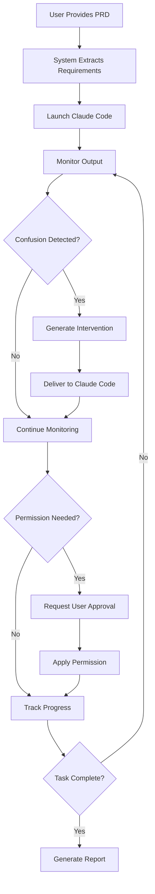

# 🤖 AI-Supervising-AI: Comprehensive Supervision System Guide

## Overview

The Integrated Supervision System is a comprehensive AI-supervising-AI solution that monitors, guides, and assists Claude Code throughout the entire development lifecycle. It automatically intervenes when Claude Code gets confused, provides missing context, handles permissions, and ensures successful project completion.

## 🎯 Core Vision

**"Monitor a project from start to finish, allow permissions, and give feedback and answers when Claude Code poses them."**

This system fulfills that vision by providing:
- **Real-time monitoring** of Claude Code execution
- **Intelligent intervention** when confusion is detected
- **Automatic context injection** for missing requirements
- **Permission management** with user approval flow
- **Workflow tracking** from PRD to completion

## 🏗️ Architecture

### System Components

```
┌─────────────────────────────────────────────────────────┐
│              IntegratedSupervisionSystem                  │
│                   (Main Orchestrator)                     │
├─────────────┬────────┬────────┬────────┬────────┬──────┤
│             │        │        │        │        │       │
│   Supervision    Claude    Intervention Context  Workflow│
│     Engine       Monitor     Manager   Provider  Tracker │
│             │        │        │        │        │       │
│   Launches &   Real-time  Intelligent Missing  Progress │
│   Controls     Output     Responses   Info     Tracking │
│   Claude Code  Tracking   Generation Injection          │
└─────────────┴────────┴────────┴────────┴────────┴──────┘
```

### Component Responsibilities

1. **IntegratedSupervisionSystem** (`IntegratedSupervisionSystem.js`)
   - Main orchestrator combining all components
   - Event routing and coordination
   - System state management
   - Statistics tracking

2. **SupervisionEngine** (`SupervisionEngine.js`)
   - Claude Code process lifecycle management
   - PRD processing and transfer
   - Process monitoring setup
   - Error recovery

3. **ClaudeCodeMonitor** (`ClaudeCodeMonitor.js`)
   - Real-time stdout/stderr monitoring
   - Pattern detection (confusion, questions, errors)
   - Line-by-line analysis
   - Session logging

4. **InterventionManager** (`InterventionManager.js`)
   - Intelligent response generation
   - Context-aware interventions
   - Permission request handling
   - Fallback strategies

5. **ContextProvider** (`ContextProvider.js`)
   - PRD requirement extraction
   - Project structure scanning
   - Missing information injection
   - CLAUDE.md management

6. **WorkflowTracker** (`WorkflowTracker.js`)
   - Multi-step workflow monitoring
   - Failure detection
   - Progress tracking
   - Intervention recommendations

7. **ErrorDetector** (`ErrorDetector.js`)
   - Terminal output analysis
   - Error pattern recognition
   - Confusion signal detection
   - Recovery suggestions

## 🚀 Quick Start

### Basic Usage

```javascript
const { IntegratedSupervisionSystem } = require('./src/services/supervision/IntegratedSupervisionSystem');

// Initialize the system
const supervision = new IntegratedSupervisionSystem({
    sessionId: 'my-session',
    projectPath: '/path/to/project',
    logger: console
});

// Start supervision with a PRD
const prdContent = `
# Project Requirements
1. Build a REST API
2. Add authentication
3. Include error handling
`;

const result = await supervision.startSupervision(prdContent, {
    autoIntervention: true,
    supervisionMode: 'comprehensive'
});

// System now monitors Claude Code and intervenes automatically
```

### Integration with Enhanced Claude Bridge

```javascript
// In enhanced-claude-bridge.js
async startSupervision(prompt, sessionId) {
    const supervision = new IntegratedSupervisionSystem({
        sessionId: sessionId,
        projectPath: process.cwd()
    });
    
    return await supervision.startSupervision(prompt, {
        autoIntervention: true,
        supervisionMode: 'comprehensive'
    });
}
```

## 🔍 Key Features

### 1. Confusion Detection & Intervention

The system detects various confusion patterns and automatically intervenes:

**High Priority Patterns:**
- "Could you please clarify..."
- "What specific requirements are you referring to?"
- "Cannot find CLAUDE.md"
- "No requirements found"

**Automatic Response:**
```javascript
// When Claude Code asks about missing requirements
Claude: "Could you please clarify what specific e-commerce checkout system requirements you're referring to?"

// System automatically provides:
Supervision: "Here are the project requirements you need:
1. Shopping cart functionality
2. Add/remove items
3. Calculate totals
4. Apply discounts
..."
```

### 2. Context Injection

When Claude Code lacks context, the system automatically provides it:

```javascript
// Context scenarios handled:
- requirements_missing: Injects PRD requirements
- file_confusion: Provides project structure
- implementation_stuck: Shows progress and next steps
- general_confusion: Comprehensive context
```

### 3. Permission Management

Handles permission requests with user approval flow:

```javascript
// Claude Code requests permission
Claude: "I need permission to create the following files:
- src/app.js
- src/cart.js
- tests/cart.test.js"

// System presents to user and can auto-approve based on rules
Supervision: "✅ PERMISSION GRANTED: Create files"
```

### 4. Workflow Tracking

Monitors progress through defined workflow stages:

```
PRD Received → Requirements Extraction → Claude Code Launch → 
Implementation → Testing → Completion
```

## 📊 Event System

### Available Events

```javascript
supervision.on('supervisionStarted', (data) => {
    // Supervision session started
});

supervision.on('interventionDelivered', (data) => {
    // Intervention sent to Claude Code
    console.log(`Intervention type: ${data.type}`);
});

supervision.on('permissionRequest', (data) => {
    // Permission needed from user
    // Call supervision.approvePermission(details) to approve
});

supervision.on('supervisionStopped', (data) => {
    // Session ended, includes statistics
});
```

## ⚙️ Configuration Options

### Supervision Modes

1. **comprehensive** (default)
   - Full monitoring and automatic intervention
   - Context injection enabled
   - Permission management active

2. **minimal**
   - Basic monitoring only
   - Manual intervention required
   - Limited automatic responses

3. **monitoring-only**
   - No automatic interventions
   - Logging and statistics only
   - Useful for observation

### Auto-Intervention Settings

```javascript
// Enable/disable automatic intervention
supervision.toggleAutoIntervention();

// Check current state
const status = supervision.getStatus();
console.log(`Auto-intervention: ${status.autoIntervention}`);
```

## 📈 Monitoring & Statistics

### Get System Status

```javascript
const status = supervision.getStatus();

// Returns comprehensive status including:
{
    sessionId: 'session-123',
    isActive: true,
    supervisionMode: 'comprehensive',
    autoIntervention: true,
    components: {
        supervisionEngine: { ... },
        monitor: { ... },
        interventionManager: { ... },
        contextProvider: { ... },
        workflowTracker: { ... },
        errorDetector: { ... }
    },
    stats: {
        sessionsSupervised: 1,
        interventionsPerformed: 5,
        questionsAnswered: 3,
        contextsProvided: 2,
        approvalsHandled: 1,
        successfulCompletions: 1
    }
}
```

## 🧪 Testing

### Run End-to-End Test

```bash
# Run the comprehensive E2E test
node src/services/supervision/test-supervision-e2e.js
```

### Test Output Example

```
🧪 Starting End-to-End Supervision Test
===========================================================
📁 Setting up test environment...
🚀 Initializing supervision system...
📋 Testing context extraction...
✅ Extracted 8 requirements
✅ Identified project type: api-server
📊 Testing Claude Code monitoring...
✅ Supervision started successfully
💉 Testing intervention delivery...
✅ 3 interventions delivered
🔐 Testing permission handling...
✅ 1 permissions handled
📈 Testing workflow tracking...
✅ 1 workflows tracked

===========================================================
📊 TEST REPORT
===========================================================
✅ Passed Tests: 12
❌ Failed Tests: 0
💉 Interventions Delivered: 3
⏱️ Test Duration: 15.23 seconds
📈 Success Rate: 100.0%

🎉 ALL TESTS PASSED! The supervision system is working correctly.
```

## 🔧 Troubleshooting

### Common Issues

1. **Claude Code not responding to interventions**
   - Ensure stdin is properly connected
   - Check process is not killed
   - Verify intervention format

2. **Context not being extracted**
   - Check PRD format
   - Ensure requirements are clearly listed
   - Verify file permissions

3. **Monitoring not detecting patterns**
   - Review pattern definitions
   - Check output stream routing
   - Ensure readline interface is active

### Debug Mode

Enable verbose logging:

```javascript
const supervision = new IntegratedSupervisionSystem({
    logger: console,  // Full console logging
    debug: true       // Additional debug output
});
```

## 🚦 Supervision Workflow

### Complete Flow Example



## 📝 Best Practices

1. **Always provide clear PRDs** with numbered requirements
2. **Enable auto-intervention** for smoother workflow
3. **Monitor events** to track supervision progress
4. **Use appropriate supervision mode** based on project complexity
5. **Review intervention history** to improve PRD quality

## 🔮 Future Enhancements

- [ ] Machine learning for better confusion detection
- [ ] Custom intervention templates
- [ ] Multi-language support
- [ ] Integration with more AI models
- [ ] Visual supervision dashboard
- [ ] Persistent session storage

## 📚 API Reference

### Main Class: IntegratedSupervisionSystem

#### Constructor
```javascript
new IntegratedSupervisionSystem(options)
```

**Options:**
- `sessionId` (string): Unique session identifier
- `projectPath` (string): Path to project directory
- `logger` (object): Logger instance (default: console)

#### Methods

##### startSupervision(prdContent, options)
Start comprehensive supervision with PRD content.

##### stopSupervision()
Stop supervision and clean up resources.

##### getStatus()
Get comprehensive system status and statistics.

##### setSupervisionMode(mode)
Set supervision mode ('comprehensive', 'minimal', 'monitoring-only').

##### toggleAutoIntervention()
Toggle automatic intervention on/off.

##### approvePermission(details)
Approve a pending permission request.

## 🤝 Contributing

To contribute to the supervision system:

1. Review the architecture documentation
2. Test changes with the E2E test suite
3. Update documentation for new features
4. Follow the existing code patterns
5. Add comprehensive error handling

## 📄 License

This supervision system is part of the Autonomous Vibe Interface project.

---

**Built with ❤️ for AI-supervising-AI excellence**